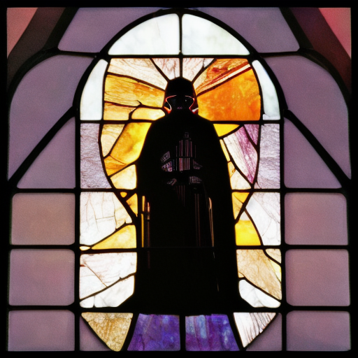

# image-gen-test

## python version:
3.11.9

## image generation model:
[midjourney-community/midjourney-mini](https://huggingface.co/openskyml/midjourney-mini)

## prompt:
```stained glass of darth vader, backlight, centered composition, masterpiece, photorealistic, 8k```

## output:


```
Generated image size:
512x512
407,4 kB
```

```
diffusers module loaded in: 2.218841314315796 s
pipeline loaded in: 2.30232572555542 s
image generated in: 278.8552391529083 s
image saved in: 0.13406658172607422 s
```